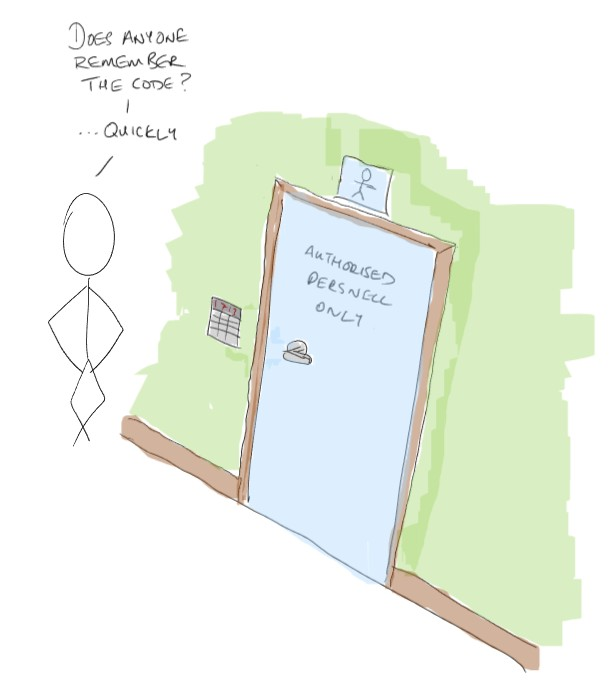
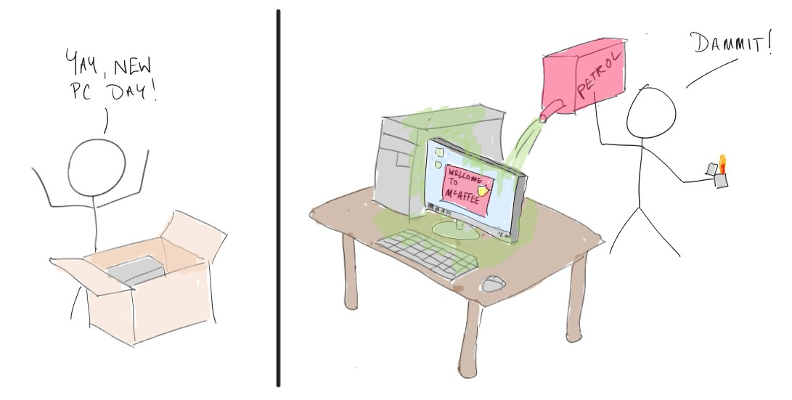

# Microsoft Azure Fundamentals: 

## Module 1 - Describe cloud concepts

## Describe cloud computing

### What is the Cloud

Simply put, the cloud is where organisations, cloud providers, have built data centers and populated them with computing hardware. Other organisations and individuals can then use the provider’s resources, and pay for just what they use, rather than having to invest in their own on-premise hardware and infrastructure.

There are lots of benefits which will be explored, but in brief, the cloud provides cost savings, flexibility, scalability, reduced overheads, and many more.

### Shared Responsibility Model
When you use cloud services, since the hardware is owned by someone else, and resides in a data center which you do not have access to, so you’re always giving away some level of control over your infrastructure. How much control you hand over is dictated by the type of services you use, as outlined by this diagram 

### Cloud Deployment Models
#### Public
The main cloud providers (AZ, AWS, GCP, etc.) would like everyone to use their services, more users equals more profit 🙂 so they’re called public cloud providers. When you use the public cloud your resources can reside on physical servers alongside those of other cloud users. They’re logically isolated of course, but in some cases, such as highly regulated industries, or highly sensitive data, you may not wish to store it on hardware which you don’t have full control over. One example is that you may need to physically destroy hard disks when you’ve finished using them, so data can never be recovered. If using a public cloud provider, you cannot do this.

#### Private
If your organisation wants some of the operational benefits of the cloud, such as flexibility so you can create multiple environments (dev/test/prod) without purchasing separate hardware, easy resource scaling, etc. But you can't hand control of your data assets to a 3rd party, you can create your own private cloud. It will be very expensive, but you own it, and have full control - *you also have complete ownership of any mistakes*

        There is another option called Co-Location (co-lo), where a third party has built a data center, the bricks and mortar, the utilities and networking, but not the servers, the customer brings their own. So you use your hardware, you can arrange physical access, but your resources are 'co-located' with other customer, in a shared physical location.

#### Hybrid
This deployment model is where customers deploy some resources and services on a public cloud provider, and retain some of their solution on-premise. These two environments can be connected together to share resources, or kept isolated. This can be very useful when an organisation has some sensitive workloads, and some which can be moved to a public cloud. However, it's worth remembering that pretty much every company has at least some physical devices, even if it's just the computers their employees use day to day. So, technically, everyone is using a hybrid solution.

### Cloud Service Types
The Shared Responsibility Model has 3 verticals (4 if you count fully on-prem), which represent the common service types. Each service you use in the cloud will fall under one of these categories

#### IaaS 
Infrastructure as a Service options are replicating the hardware devices that you would purchase and deploy on-premise, and provide you with a similar level of control, and allow you to make similar choices. You don't necessarily need to worry about cables, routers, and switches, but, from the server's specification and upwards, you have control of everything you deploy, and whatever you build upon them.
#### PaaS
Platform as a Service solutions hand over a more control of your infrastructure to the cloud provider. Use PaaS options when you want to deploy an application, and you require a certain level of performance and reliability, but how the underlying resources are deployed and configured is not really important to you. With PaaS you bring your application code, data, configure users and access, then the compute resources are assigned and allocated dynamically by the cloud provider. 
#### SaaS
Software as a Service is for when you require pre-existing software packages, like PaaS, you don't want to worry about any servers running the software, or have to make any scaling decisions, etc. But in this case you're not providing your own application code, you're using an application from someone else, you just need to configure the app, and provide your users with access. 

        Another advantage of SaaS services is that software license costs can become a monthly operational expense (OpEx), just like your compute resources when you adopt cloud solutions, you no longer need to make significant capital expenditure (CapEx) for your software licences. 

### Consumption Based Model

One of the most attractive benefits of the cloud is the ability to transform your business' spending model from one reliant upon capital expenditure, buying assets up front (or on credit), requiring significant investment. When it comes to IT resources, these investments will also depreciate over time, so you have to be confident that you will achieve an ROI.

The default method of paying for resources you deploy in the cloud is based on consumption, i.e. how much of each resource you consume, or Pay as You Go (PAYG). 

Say you need a server with 8 CPU cores (and associated resources), running for 8 hours a day. On-premise you need to purchase that server, let's say it's £5,000. Obviously, you pay that cost regardless of how much you use the device, 8 hours per day, or 24. 

Don't take these figures as real, but just illustrative. Let's now say that to deploy the same server in the cloud would cost you 10p per hour. 24 hours per day, 30 days per month, that's 720 hours, at 10p per hour, your server costs you £72 per month. That is obviously a much more attractive figure, in fact you'd have to use the cloud server for >69 months to match the cost of the in-premise server. 

But, we can go lower; If you only need the server for 8 hours per day, and let's assume only Monday-Friday, then 8 hours, times 20 days per month is 160 hours. 10p per hour for 160 hours is just £16 per month.

Ok, that's an extreme case, in reality some of the resources would continue incurring costs when switched off, such as the storage space you're using, and public IP addresses you have reserved, but significant savings are possible.

## Describe the benefits of using cloud services

### High Availability

High availability is the idea that your resources and workloads remain operational and accessible, and in the face of changing circumstances, such as hardware rack or data center failure, availability zone or regional failure, even geography failure, if desired. 

When architecting a cloud solution, you can take advantage of the Azure infrastructure features to achieve the level of resilience required. Microsoft have designed their infrastructure to provide high availability, so your deployment strategy dictates the service level agreement (SLA) provided.

### Scaling

Scaling refers to changing the quantity, capacity, speed, etc. of your resources in response to changing workloads. This could be adding additional virtual machines to share a workload, or adding more storage space as needed. But since we pay for what we use in the cloud, it's also important to scale back down when demand falls; This is known as elasticity. 

There are two types of scaling:

- Vertical scaling refers to making one resource more powerful, so you could upgrade a server's CPU to one with more cores, or you could add more RAM to the system. One advantage of vertical scaling is that you can improve performance for less cost than a complete additional system. However, the system usually needs to be taken offline to complete the upgrade.

- Horizontal scaling is about adding extra copies of a resource, so deploying an additional server, then sharing the workload across them. Adding the additional server should not affect the original, so no downtime is incurred, but you likely have to purchase a whole additional server.

On-premise scaling is difficult for a number of reasons - Organisations usually need a return on their investment, if they purchase an expensive server they expect it to be doing some work and contributing to their revenue. So, having a spare server sat idle, but ready to turn on and share the workload as needed, doesn't really make sense. As mentioned, vertical scaling may be more cost effective, but requires you to plan for downtime, which may impact business operations. 

In the cloud both horizontal and vertical scaling can be done. Although scaling applies to various services, we'll stick to VMs for simplicity - you can change the size or type of a VM, or change the size of the attached VHD, but doing so requires stopping the machine. You can also quickly and easily horizontally scale by adding additional VMs - The cloud overcomes one of the barriers to horizontal scaling on-premise, because you don't need to purchase the hardware in advance, just deploy as needed, and tear down when demand falls. 

	Sharing a workload across multiple resources is not as simple as just deploying a duplicate - you also need a load balancer to distribute the inbound requests, and consider endpoints, shared storage, etc. 

### Reliability & Predictability

Organisations which are running critical workloads, who rely upon their IT infrastructure to support business operations, need their infrastructure to be both reliable, and operate predictabily, i.e. what is expected to happen should happen. The cloud, and cloud-based technologies can bring significant improvements and benefits in these areas. 

Reliability in the cloud can be considered in a number of ways; In terms of a single server, assuming your on-premise device has reliable utilities and cooling, perhaps the cloud provider's data center has more redundancy built in, but at the end of the day a single server can be expected to fail at some point, regardless of where it is. However, the cloud will provide far more accessible options for you to deploy reliable solutions. Examples include:

- Deploying multiple resources and load balancing, so if one fails there are others to take up the slack.
- Scaling resources to reduce the likelyhood of failure as workloads increase.
- Deploying failover solutions where traffic is directed to one primary resource, then re-directed to the failover in case of primary failure. 
- Services such as storage will automatically make multiple copies of your data to meet any reliability and durability requirements.
- Intergrated monitoring of resources and workloads can provide early indication of impending failure, allowing for intervention.

There are many other strategies which may be implemented. 

### Security and Governance

Every organisation has to consider the security of their assets and infrastructure as a priority. In our earlier modules we have already considered many security controls, including:

- Harden servers by disabling and/or removing unnecessary app's and services; Restrict access and permissions following the principle of least privilge; Install host-based anti-virus and firewall software; Update and patch; Etc.
- Secure networks with properly configured routers, switches, and firewalls; Deploy network intrusion/prevention systems; Segment networks with subnets to isolate traffic and resources; Etc.
- Deploy physical security controls such as ID badges, physical entry controls, CCTV, security personell, along with organisational wide training, policies, and process for reinforcement of controls.

When deploying to the cloud, many of your existing security controls, with the exception of physical ones, will likely work just the same, you just deploy them to your cloud environment instead.

Azure has considered security during the development of their different service offerings, providing you with the ability to implement granular access control, encryption at rest and in transit, deploy backup and failover solutions, and many more security controls directly within the relevant service. However, correctly configuring these services to meet your needs, is your responsibility (at, least with IaaS and PaaS solutions it is).

In addition to the security controls embedded into the different resources, Azure also offers a wide range of services which are specifically focused upon providing advanced security capabilities. Some examples include:
- Entra ID (formerly AzAD), which acts as a secure identity provider, and can provide AAA capabilities for your Azure, on-premise, and multi-cloud resources and environments;
- Azure RBAC to allow users to access only the resources they are required to access based on their roles within the organization.
- Microsoft Sentinel which delivers intelligent security analytics and threat intelligence

... and many others. 

### Manageability

Manageability in Azure refers to the ability to Migrate, Secure, Protect, Monitor, Configure, and Govern your resources and workloads in the cloud. For effective management you require:
- Insight into your inventory and service catalog
- Understanding of your operational compliance requirements
- Protection and recovery capabilities
- Baseline metrics for workload operations

In addition to support for 3rd party management tools, there are a variety of services available through Azure to facilitate and enhance your management capabilities. Some examples include:
- Azure Monitoring provides granular monitoring capabilities for resources in Azure, on-premise, and multi-cloud environments. A wide range of pre-defined and custom metrics can be used to monitor and evaluate your workloads and resources.
- Azure Automation provides services for automating configuration tasks.
- Azure Policy allows you to create, assign, and manage policy definitions to enforce rules for your resources.
- Microsoft Defender for Cloud, which includes unified security management and advanced threat protection across hybrid cloud workloads.
- Azure Migrate is a service that helps you discover, assess, and migrate on-premises virtual machines to Azure.

## Module 2 - Describe Azure Architecture and Services

## Describe the Core Architectural Components

### Describe Azure physical infrastructure

#### Geographies

Geographies represent geo-political boundaries, and also billing boundaries in Azure. As an example, consider the EU, which comprises multiple independent countries, but with equal privacy protections and data sharing agreements. So for Azure's purposes, it can be considered one Geography for data-residency and compliance reqirements. Geographies comprise multiple regions.

#### Regions

Regions are within countries, but a country may have multiple regions. They contain at least one, but typically multiple data centers, which are relatively close to each other, and networked with dedicated, low latency connections.

When you deploy to a region, Microsoft intelligently selects the appropriate data center for your resources, to balance the workload.

#### Region Pairs

Most regions are paired with another regions within the same geography, but at least 300 miles away. This allows for resource replication in a manner that can be resilient to significant regional outages such as natural disasters. Data and resources replicated across region pairs will continue to reside in the same geography for data-sovereignty, tax, and legal purposes. In the case of a Geographical outage such as a natural disaster, Microsoft will prioritise the restoration of services to one of the pair, to restore services as soon as possible.

#### Sovereign Regions

Sovereign regions are instances of Azure which are isolated from the rest of the global infrastructure. They are designed to meet legal and compliance needs in highly restrictive areas. Examples include US DoD Central, US Gov Virginia, US Gov Iowa which are restricted to screened personnel. Also, China East and China North regions, which are operated via a partnership with 21Vianet.

#### Availability Zones

Availability Zones represent physically seperate data centers within an Azure region. An Availability Zone contains one or more DC's, deployed in such a manner that the DC's on one Availabilit Zone are supplied by different utilites to another Availability Zone, so that if one were to go down, due to a power cut, the neighbouring zone should be unaffected.

Not all regions are enabled for Availability Zone functionality, but regions were they are enabled comprise of at least 3.

#### Zonal Services

You can use availability zones to run mission-critical applications and build high-availability into your application architecture by co-locating your compute, storage, networking, and data resources within an availability zone and replicating in other availability zones. 

Azure services that support availability zones fall into three categories:

- Zonal services: You pin the resource to a specific zone (for example, VMs, managed disks, IP addresses).
- Zone-redundant services: The platform replicates automatically across zones (for example, zone-redundant storage, SQL Database).
- Non-regional services: Services are always available from Azure geographies and are resilient to zone-wide outages as well as region-wide outages.

Two or more VMs, deployed across 2 or more availability zones, have an SLA of 99.99%.

### Azure management infrastructure

#### Resource Groups

In Azure, anything you create, provision, deploy, etc. is a resource. When you create a resource you are required to place it into a Resource Group, which is simple a collection of resources. However, RG's may not contain other RG's, i.e. they cannot be nested.

A Resource Group can contain many resources, each resource may only reside in one RG at a time, but may be moved from one to another.

RG's provide a scope for applying access controls, or carrying out management actions against all resources in the RG, including deleting them all at once.

There are no rules defining how to structure your resources and resource groups, so you're free to create them in a manner which reflects your business' needs.

#### Subscriptions

Similar to how resource groups are a way to logically organize resources, subscriptions allow you to logically organize your resource groups and facilitate billing.

A subscription is required to provide authenticated, authorised access to Azure services and resources. An Azure account can have multiple subscriptions, but at least one.

An Azure subscription is both a billing boundary for all resources within, and it may also be used as an access management boundary. For example, you may choose to use a different subscription for each of your clients, so that you can accurately bill them for resources created on their behalf. However, you may have employees that work on multiple client accounts, and therefore needs access to each relevant subscription.

In addition to billing purposes, Subscriptions are commonly created to map to organisational structure, to separate environments such as `dev'`, `test`, & `prod'`.

When you create your free tier Azure account a free tier subscription is created for you. After your trial expires, you must upgrade to a paid subscription to continue using Azure.

#### Management Groups

Resources are gathered into resource groups, and resource groups are gathered into subscriptions. You then organize subscriptions into containers called Management Groups, allowing you to manage access, apply policies, and implement compliance and governance conditions.

Management groups can be nested.

#### Hierarchy

The following diagram shows a hierarchy of management groups and subscriptions, which in turn will hold resource groups (not shown).

- 10,000 management groups can be supported in a single directory.
- A management group tree can support up to six levels of depth. This limit doesn't include the root level or the subscription level.
- Each management group and subscription can support only one parent.

## Describe Azure compute and networking services

### Describe Azure virtual machines

A virtual machine is a software defined computer, running upon a physical host, which has access to the underlying hardware via a Hypervisor. Azure Virtual Machines is an IaaS offering, allowing the Azure user to deploy virtual servers with:

- Full control over the VM's operating system
- The ability to run any software they want
- The ability to build custom configurations when requirements are not met by another offering.

As an IaaS service you have this level of granular control and flexibility, including selecting your desired specifications, without the need to spend capital on purchasing on-premise hardware. But, as with on-premise deployments, you are also responsible for ensuring the correct and secure configuration is applied, and maintained.

You are not limited to the pre-configured VMs available through the Portal or Marketplace. You can also migrate your own custom VM's, or export and import system images and virtual hard disks (VHDs).

### VM Scaling

It is common to run multiple VMs grouped together to, for example, share workloads and increase performance, provide high availability, or redundancy.

#### Virtual machine scale sets

Virtual machine scale sets let you create and manage a group of identical, load-balanced VMs. You could create them manually, but you would then need to ensure that they has the same configuration, the same software stack, set up network routing rules, and create a custom monitoring dashboard. 

Scale sets automate much of this work, allowing you to centrally manage large numbers of VMs and have configuration changes and updates automatically applied.

The number of VMs in the scale set can increase or decrease in response to demand or based on a set schedule. Scale sets will also deploy a load balancer automatically, ensuring efficient utilisation of your resources.

#### Virtual machine scale sets

Availability sets allow you to deploy solutions which provide high availability and resiliency against hardware rack failure within a data center, but not against an entire data center outage.

Hardware faults are going to occur, when they do, because of the design of data centers, they should be isolated to a single rack of hardware. To mitigate this risk, Microsoft are monitoring millions of signals to predict these potential failures. When they identify a problem they will schedule and carry out some planned maintenance. 

Microsoft publishes the data/time that this maintenance will occur, so you can relocate your resources in advance, and they will also relocate live resources on the affected server before taking it down. *If you leave it to Microsoft, there may be a small service interruption*.

Despite Microsoft's best efforts, they cannot guarantee that an unexpected failure will not occur, as such a single VM only receives a 99.9% SLA. 

An availability set is a deployment strategy which utilises two logical groupings, Fault Domains and Update Domains, to provide resilience against unexpected failure.

#### Fault Domains

Fault domains are basically racks in the data center containing servers. A fault domain has an isolated power supply and networking from other fault domains, so that a hardware failure only impacts that domain.

#### Update Domains

Update domains are comprised of physical servers in the data center, but the member servers are spread across a range of fault domains. Update domains are used by Microsoft to strategically carry out updates and maintenance to the physical hardware, or OS level updates, to the servers in their data centers. Microsoft will only carry out updates and maintenance to servers one update domain at a time. They will wait until one round of updates are complete before moving on to the next update domain.

By deploying at least two VMs into an availability set they will be deployed in different update and fault domains, provding resilence against hardware failure, and maintenance activities requiring host downtime. The SLA for two VMs in an availability set is 99.95%.

Availability sets do not incur any costs, you only pay for the VMs within.

### VM SLA Summary
|Deployment|SLA|
|---|---|
|Single VM|99.9%|
|2 or more VMs in an availability set|99.95%|
|2 or more VMs in 2 or more availability zones|99.99%|

### VM Use cases

As mentioned, VMs are suitable when you require the highest level of control over your resources, but there are a number of scenarios where they are a good choice also:

- **Testing and Development** When developing apps it is common to need to verify functionality and compatibility with a variety of O/S and software configurations, which can be quickly deployed and destroyed as VMs. 
- **Running Apps** Some applications may not 'scale to zero' or have rpaidly fluctuating demand which requires performance head room to be maintained.
- **Building Hybrid Infrastructures or Migrating** When connecting VM based workloads in private cloud or on-premise, or migrating existing VMs using a 'lift and shift' approach, minimising admin and developer work in redesigning workloads for cloud operation. 
- **Disaster Recovery** A common strategy is for organisations to rebuild their infrastructure in the cloud, then turn it off to minimise costs. In the case of an outage at the primary site, the cloud environment can be launched in minutes, then traffic and workloads can be redirected to your cloud endpoints to restore service.

### VM Resources

When deploying a VM, in addition to resource like CPU cores and RAM, it requires a number of additional supporting resources, including storage both for the operating system, and, if desired, persistent user data. Additonially, since you obviously can't' sit in front of your VM and use it as a local user with a keyboard, mouse, and monitor, the VM needs both a VNet and a virtual network interface card (NIC). You may also wish to allocate a public IP address to the VM, which is another resource. 

If you do not manually define these parameters they will be created automatically.

### Azure Virtual Desktop

Organisations have a wide range of compute requirements, many of which can be met with virtual machines, but cloud providers offer a wide range of different compute services which can be more suitable, offer greater performance, or cost effectiveness than dedicated VMs.

One such example is Azure Virtual Desktop (AVD). Traditionally, if a user works in a desktop environment, carrying out typical productivity tasks with common O365 apps, you give that user a computer running the required OS, and install all of the required app's. You then manage them using, ideally, some automated configuration management tool and/or group policy. You may also let your users use their own computer, known as 'bring your own device (BYOD), but that introduces further administrative overhead and security concerns.

Azure Virtual Desktop is a PaaS offering, which can provide a virtualised Windows 10 or 11 desktop experience, which can be accessed through a client app on Windows, Mac, iOS, & Android, or any device with a web browser. 

AVD lets you virtualise multiple desktop and application environments on Azure VMs, and present them to your users, instead of installing and managing them on local devices. 

From the end users POV, they expect to click on an icon on their desktop or start menu, and have an app pop up. That is exactly what they get, it's just that the app, and/or the desktop, is running remotely. Each user's desktop, data, and app's are isolated from each other, and when delivered through the relevant client app the experience can be identical to running the environment locally.

While virtual desktop solutions can be created manually with on-premise technologies, doing so can be very challenging, with complex requirements and significant administrative overhead. AVD simplifies and streamlines the process by automating many of the requirements and configuration. Additionally, AVD can be cost effective compared to deploying a whole computer per person, as a single or cluster of VMs can deliver virtualised desktops and apps to many different users simultaneously.

### Azure containers

As flexible and configurable as VMs are, there are also some limitations:

- Each virtual machine includes an entire OS, and software stack, which means that changes and deployments can take a little while - we're talking minutes, but any downtime is a problem. 
- You have to pay for a VM's attached storage, so, if you need to deploy multiple servers with the same operating system, there is potentially a lot of duplicate data.
- Whilst portable, we can migrate VMs from on-premise to the cloud and vice-versa, they can be quite large, so the process of moving them can take some time, on a slow connection for example.

Containers are another type of virtualised environment, but unlike a VM, they don't require a full OS, just a user environment, the application code, and maybe any required dependencies or middleware. This makes them much smaller, faster to deploy and change, and they more efficiently use resources. You can typically run many more containers on any given physical server compared to VMs, and you don't need multiple copies of the operating system running.

There are a number of services in Azure which can be used to run and manage containers:

In the same way that a VM requires a hypervisor, to create and run containers you require a *container engine*, the most popular one is called **Docker**.

#### Azure Container instances

Azure Container Instances is a PaaS offering which provides a quick and easy way to deploy and manage your containers. They run on VMs, but you do not have direct access or control over the underlying services. Microsoft will add more instances as needed to provide compute sufficient resources for all running containers.

#### Azure Container Apps

Azure Container Apps is similar to ACI, but hands additional container management responsibilities to Azure. Container Apps can automatically implement features such as load balancing and scaling.

#### Azure Kubernetes Service

Kubernetes is a containers orchestration service, which allows you to deploy and manage fleets of containers, which run on multiple compute nodes, as part of a cluster. 

        Containers are commonly used to create *microservice* architectures. Traditionally applications were developed following a *monolithic* approach, with all code, functions, modules, assets, bundled together in one big package. Hosting and resource choices are defined by the requirements of the 'heaviest' part of the app.

        A microservice approach separates the functions and components of the application into separate parts, which can then be reconnected back together using APIs. This allows you to de-couple app functions, and make choices to suit these individual components. For example, the front end may be a static website, some components may be containerised, and some may be serverless functions.

### Azure Functions

#### Serverless Computing

All of us need compute resources, and traditionally, or in the on-premise world, those resources are purchased up-front, deployed and configured, then you can utilise it. 

We can make virtual machines, but they still used our underlying compute resources. If our virtual machines are in the cloud, we don't need to buy the resources up front, which is a big benefit, of course. When we do this, we can choose IaaS services and have full control over the VMs and their configuration. We can also choose options such as Azure App Service or Azure Container Instances which will create VMs for us to run our workloads, and these VMs are managed and maintained by Microsoft, easing our admin burden. However, with these services, you often need to pay for the underlying instance, even if it's not being used. 

What if we could just give our application code over to a service, and have it run? No worrying about infrastructure and configuration; No worrying about instance limits in App Service Plans; Just upload your code and run it - This is serverless compute.

Obviously, if you need some compute power, there needs to be a computer somewhere. But with serverless services, you never need think about it. The cloud provider has plenty of unused compute capacity in their data centers to run your code, so if you don't care *how* your code runs, as long as it runs, serverless services may be suitable.

#### Azure Functions

Azure Functions runs your code in response to an event, which can be a REST API request, on a schedule, or be triggered by another Azure service. 

Functions can scale quickly on demand, so they are good for senarios with variable demand. Azure Functions also deallocates resources when finished, and you only pay for CPU execution time. 

Azure Functions natively supports code written in C#, Java, JavaScript, PowerShell, and Python, with more supported through custom handlers.

### Describe application hosting options

To host an application in Azure you may consider launching a VM, or deploying containers, particularly if you want to 'lift and shift' an existing workload. However another common hosting option is Azure App Service.

#### Azure App Service

Azure App Service is an HTTP-based service for hosting web applications, REST APIs, and mobile back ends. It supports multiple languages, including .NET, .NET Core, Java, Ruby, Node.js, PHP, or Python. It can run apps in both Windows and Linux environments, with no infrastructure to manage.

- Deployment and management are integrated into the platform. App Service can intergrate with a Continuous Deployment pipeline from GitHub, Azure DevOps, or any Git repo'.
- Endpoints can be secured.
- Sites can be scaled quickly to handle high traffic loads.
- The built-in load balancing and traffic manager provide high availability.

The customer can focus upon developing and maintaining the app, Azure focus upon keeping it running.

Azure App Service can host:
- Web apps developed using the languages listed above
- REST API apps which can be consumed from any HTTP/HTTPS based client
- Mobile Apps as a back-end for iOS and Android apps, for example storing app data in the cloud, authenticating mobile app' users, sending push notifications, etc.
- WebJobs - run a program or script alongside a web app, API, or mobile app

### Describe Azure virtual networking

It sounds obvious, but since cloud resources are deployed remotely, to access and work with them, they need access to a network. On-premise networks have:
- **Routers** which connect networks together, such as private networks to the public internet, allow us to make routing rules which define how traffic can reach specific destinations, define subnets for network segmentation, and implement NAT.
- **Switches** which connect multiple devices to the network forming a LAN, can be connected to each other to expand the network, and can implement access control and segmentation with features like MAC filtering and VLANS.
- **Firewalls** allow us to implement rules which filter the ports, protocols, IP addresses, and more, from which traffic is permitted or denied.
- **Cables (or RF)** are used to physically connect clients to networks. They operate at a particular standard, which dictates your network bandwidth and other factors. 

All of these features and more, need to be replicated in your virtual networks in the cloud - with the exception of the physical connection - but bandwidth for your virtual resources remains a consideration.

Azure VNets facilitate:

- Isolation and segmentation
- Internet communications
- Communicate between Azure resources
- Communicate with on-premises resources
- Route network traffic
- Filter network traffic
- Connect virtual networks

#### IP Addresses

Azure VNets support both public and private endpoints:
- **Public endoints** are assigned a public IP, and can be accessed from the internet, or through an internet facing load-balancer - *assuming you permit the traffic through your Network Security Group, and Azure Firewall if deployed*.
- **Private endpoints** receive a private IP, and can only communicate with resources in the same address space*.

        *There are deployment options which do not require public access to resources in order to remotely manage them, for example by using a *Bastion* server

#### Segmentation and Routing

When you set up a virtual network, you define a private IP address space which only exists within the virtual network and isn't internet routable. You can then subnet the address space to divide the range into your required subnets.

Azure routes traffic between subnets on any connected virtual networks, on-premises networks, and the internet automatically, but if you wish to control routing you can use:

- **Route tables** define how traffic should be directed, you can create custom routes that control how packets are routed between subnets, for example to restrict traffic from one subnet from reaching another that contains sensitive assets.
- **Border Gateway Protocol (BGP)** a routing protocol which allows neighbouring routers on the internet to share known routes. It works with Azure VPN gateways, Azure Route Server, or Azure ExpressRoute to propagate on-premises BGP routes to Azure virtual networks.

For name resolution, you can configure the virtual network to use either private or public DNS.

#### Communicating Securely with...

##### ...Azure Resources
Virtual networks can connect VMs in the same address space, but also other services such as Azure App Service, Azure Kubernetes Service, and VM Scale sets.

Some Azure services, such as databases and storage accounts, may need to connect to multiple resources and VNets. For this **Service Endpoints** can be used.

##### ...On-Premise Resources
To create a network which spans your Azure and on-prem' resources you can use the following options:
- **Point to Site VPN** - a client computer initiates a VPN connection to your Azure VNet.
- **Site to Site VPN** - links your on premise VPN gateway to an Azure VPN Gateway. Azure and on-premise resources appear to be on the same local network.
- **Azure ExpressRoute** - set up a private connection between your on-premise environment and Azure, which does not traverse the internet. Useful for environments where you need high levels of bandwidth and security.

#### Filter network traffic

You can filter traffic between subnets, VNets, and the internet using both:
- **Network Security Groups** which are Azure resources which contain inbound and outbound rules to define which types of traffic should be blocked or permitted. Create rules based on source or destionation IP, port, or protocol.
- **Virtual Appliances** are dedicated VMs which run applications providing network functionality such as firewalls, packet inspection, optimisations, etc. To use such a device you will create routing rules which directs traffic to the device before before it is then forwarded to it's destination.

#### Connect virtual networks

**Virtual Network Peering** allows you to connect VNets together, traffic between them is private, and traverses the *Microsoft backbone network*, not the internet. Vnets may be in different regions, allowing the creation of a global infrastructure. 

Control traffic routing within and between VNets by creating **User Defined Routes**.

### Describe Azure virtual private networks

A VPN is an encrypted tunnel through a network, typically it is used to connect two trusted endpoints through an untrusted network such as the internet. 

A VPN may be configured on individual devices by installing VPN client software, or you can configure an appliance in each of your trusted networks as a VPN gateway. 

1. You bring up a VPN between the gateways 
2. Update your route tables to direct your sensitive traffic through the it 
3. Traffic will be automatically encrypted and decrypted as it enters and exits the tunnel.

#### Azure VPN Gateways

Azure VPN Gateways are commonly used to:
- Connect on-premises datacenters to virtual networks through a site-to-site connection.
- Connect individual devices to virtual networks through a point-to-site connection.
- Connect virtual networks to other virtual networks through a network-to-network connection.

You can only deploy one VPN Gateway in each VNet, but one G/W can be connected to multiple locations.

You can specify two types of VPN, based on how it should determine which traffic requires encryption:
- **Policy-based** - specify the IP addresses of packets which should be encrypted. Every packet is evaluated, and matches are directed through the tunnel.

- **Route-based** - tunnels are presented as interfaces. IP routing decides which one of these tunnel interfaces to use when sending each packet - use when creating connections between VNets, Point-to-site connections, and Multisite connections.

#### High Availability

VPNs are used to improve security and privacy, and if this a compliance requirement, you do not want operations grinding to a halt in the case of the VPN going down. To configure a resilient VPN you have several options:

##### Active/Standby

By default Azure VPN gateways are deployed as two instances in an active/standby configuration. When disruption affects the active instance, the standby automatically assumes responsibility for connections without any human intervention. Connections are interrupted during failover, but they typically restore within 90 seconds for unplanned disruptions.

##### Active/Active

In this configuration, you assign a unique public IP address to each instance, then create separate tunnels from the on-premises device to each IP address. You can extend the high availability by deploying an additional VPN device on-premises.

##### ExpressRoute failover

Customers with ExpressRoute connections commonly configure a VPN gateway as a secure failover route.

##### Zone-redundant gateways

In regions that support availability zones, VPN gateways and ExpressRoute gateways can be deployed in a zone-redundant configuration.

#### Describe Azure ExpressRoute

Azure ExpressRoute lets you extend your on-premises networks into the Microsoft cloud over a private connection, they don't go over the public Internet.

You can establish connections to Microsoft cloud services, allowing you to connect offices, datacenters, or other facilities to the Microsoft cloud. Each location would have its own ExpressRoute circuit.

Bring up an ExpressRoute circuit with a connectivity provider at a colocation facility. This setup allows ExpressRoute connections to offer more reliability, faster speeds, consistent latencies, and higher security than typical connections over the Internet.

Each connectivity provider uses redundant devices in every peering location for higher reliability.

ExpressRoute enables direct access to the following services in all regions:
- Microsoft Office 365
- Microsoft Dynamics 365
- Azure compute services, such as Azure Virtual Machines
- Azure cloud services, such as Azure Cosmos DB and Azure Storage

ExpressRoute supports four models for connecting your on-premises network to Azure:

- **CloudExchange colocation** - when your datacenter, office, or other facility is physically colocated at a cloud exchange, such as an ISP, you can request a virtual cross-connect to the Microsoft cloud.
- **Point-to-point Ethernet connection** - use a point-to-point connection to connect your facility to the Microsoft cloud.
- **Any-to-any connection** - integrate your wide area network (WAN) with Azure.
- **Directly from ExpressRoute sites** - connect through one of Microsoft's global network of peering locations strategically distributed across the world. ExpressRoute Direct provides dual 100 Gbps or 10-Gbps connectivity, supporting Active/Active connectivity at scale.

### Describe Azure DNS

#### Describe DNS

The Domain Name System is a service which maps URLs to IP addresses. As we've explored previously, resources on the internet require a public IP address to be reachable, however, humans are not very good at remembering lots of different numbers. 

We can remember names though, so we can purchase an unused domains from a domain registrar, and we map our new domain name to our resources using DNS.

So, if I own the domain 'frankiethesausage.co.uk' and I have a web server hosting a web site at 109.212.13.240 I can make a DNS record which points any requests for frankiethesausage.co.uk, which is easy to remember, to the IP address which isn't.

This would be an example of an `A` record, which maps a `URL` to an `IPv4` address. Two other common record types are `AAAA` which point to IPv6 addresses, and `MX` which point to mail servers. One more important record is a `CNAME` (canonical name), this is used to map one domain name to another. The most common use of a CNAME is to, in this case, point the address 'www.frankiethesausage.co.uk' to the same IP address as the A record.

When you have purchased a domain name your registrar will typically offer a public DNS service to which you can add your records, but you can also migrate it to another DNS service, either running on a server you deploy and configure, or a managed service such as Azure DNS.

        If you want the functionality of DNS within your private network, and you don't need your resources to be publically accessible via a friendly domain name, you can deploy a private domain server and domain. 

#### Azure DNS

Azure DNS hosts public and private DNS domains, providing name resolution across Microsoft Azure infrastructure. You can manage your DNS records using the same credentials, APIs, tools, and billing as your other Azure services.

Azure DNS leverages the Azure infrastructure to provide:
- Reliability and performance - Azure DNS uses anycast networking, so the closest available DNS server answers each query.
- Security - Azure DNS is based on Azure Resource Manager, which provides:
  - RBAC - to control who has access to specific actions
  - Activity Logs - to monitor how resources are modified
  - Resource locks - prevents users from accidentally deleting or modifying critical resources
- Ease of Use - Azure DNS is integrated in the Azure portal and uses the same credentials, support contract, and billing as your other Azure services.
- Customisability - use your own custom domain names in your private virtual networks, rather than being stuck with the Azure-generated names.
- Alias records - your Azure resources can receive a public IP address, and a DNS name. The IP may change, but the name will not, so you can use Alias record to map a resource name to an endpoint.

### Describe Azure storage services

A storage account provides a unique namespace for your Azure Storage data that's accessible from anywhere in the world over HTTP or HTTPS. Data in this account is secure, highly available, durable, and massively scalable.

You select the storage account type which determines the storage services and redundancy options, and has an impact on the use cases. 

Available redundancy options include:

- Locally redundant storage (LRS)
- Geo-redundant storage (GRS)
- Read-access geo-redundant storage (RA-GRS)
- Zone-redundant storage (ZRS)
- Geo-zone-redundant storage (GZRS)
- Read-access geo-zone-redundant storage (RA-GZRS)

Every storage account in Azure must have a unique-in-Azure account name (3-24 characters; lowercase, a-z & 0-9 only), which is used to create a unique namespace for your data. The combination of the account name and the Azure Storage service endpoint forms the endpoints for your storage account.

The following table shows the endpoint format for Azure Storage services.

|Storage service|Endpoint|
|---|---|	
|Blob Storage|https://<storage-account-name>.blob.core.windows.net|
|Data Lake Storage Gen2|https://<storage-account-name>.dfs.core.windows.net|
|Azure Files|https://<storage-account-name>.file.core.windows.net|
|Queue Storage|https://<storage-account-name>.queue.core.windows.net|
|Table Storage|https://<storage-account-name>.table.core.windows.net|

#### Azure storage redundancy

##### Locally redundant storage

LRS replicates your data three times within a single data center in the primary region and provides 11 nines (99.999999999%) durability for objects over a given year.

LRS is the lowest-cost redundancy option and offers the least durability, it is designed to protect against rack and drive failures, but not a data center failure - mitigating this risk requires ZRS, GRS, or GZRS.

##### Zone-redundant storage

ZRS replicates your data synchronously across three Azure availability zones in the primary region, and provides 12 nines (99.9999999999%) durability for objects over a given year.

With ZRS your data remains accessible for read and write operations if a zone becomes unavailable, no remounting is necessary.

Azure recommends using ZRS for high availability in a single region, and replicating within a region to ensure complicance with data governance restrictions.

##### Geo-redundant storage

GRS copies your data *synchronously* three times within a single location in the primary region using LRS; It then copies your data *asynchronously* to a single location in the secondary region (the region pair) using LRS. 

GRS offers durability of at least 16 nines (99.99999999999999%) over a given year.

##### Geo-zone-redundant storage

GZRS, as the name suggests, combines ZRS and GRS features. Data is replicated across 3 availability zones in the primary region, and replicated to a secondary region. 

GZRS is designed to provide at least 16 nines (99.99999999999999%) of durability of objects over a given year.

##### Read access to data in the secondary region

With both GRS and GZRS you can enable read-access to data in the secondary region, so it can be accessed even if the primary region is operational. This can provide lower latency to users closer to the secondary region. 

        Remember that data in the secondary region may be out of date if changes were made in the primary region which have yet to be replicated. 

#### Azure storage services

Storage is one of the most common services companies require from their cloud provider, not least because most resources will need to have access to, or generate some data, and data is usually an organisation's most valuable asset.

Azure Storage is:
- Durable and highly available - you can make decisions on the level or durability, and resilience to faults that you require. E.g. do you need to be resilient to data center, availability zone, or regional failure?
- Secure - All data in an Azure storage account is encrypted, and you have granular access control for the data objects.
- Scalable - Microsoft deploys significantly more storage capacity into their data centers than is currently demanded, providing scope for customers to massively scale their solutions to meet rapidly changing workloads. 
- Managed - Microsoft manages the underlying infrastructure of their storage services, including hardware, software, updates, maintenance, etc.
- Accessible - Objects in Azure storage may be accessed from anywhere through HTTP/HTTPS, and REST APIs. Microsoft also provides client libraries for a variety of programming languages, allowing you to embed Azure Storage functionality into your app development. 

Once you have created a storage account, you can deploy storage containers of various types, which are optimised for various use cases:

##### Azure Blobs
Binary Large OBjects (BLOBs) are any binary file, which is basically any file, text, image, video, anything. Azure Blobs are unstructured, allowing any type of data to be added. Users or client applications can access blobs via HTTP or HTTPS, via URLs, the Azure Storage REST API, Azure PowerShell, Azure CLI, or an Azure Storage client library.

    Blob storage is ideal for:

  - Serving images or documents directly to a browser.
  - Storing files for distributed access.
  - Streaming video and audio.
  - Storing data for backup and restore, disaster recovery, and archiving.
  - Storing data for analysis by an on-premises or Azure-hosted service.

  It is typically free to transfer your data into the cloud, and then you are charged for the amount of storage used, and retrieving the data - *that's not just downloading it, but just accessing the object requires you to read it*. Typically data is most valuable, and most frequently accessed, when it is new, a new report, a new customer account, and so on.
  
  **Storage tiers** allow you to optimise storage costs by balancing the cost of capacity against the cost of retrieval, and how long the storage is required for. The following storage tiers are available:

  - **Hot Access Tier** - For data which is frequently accessed, capacity cost may be a bit higher, but retrieval costs are lower.
  - **Cool Access Tier** - For data which is accessed less frequently, retrieval costs will be higher, and capacity costs lower. Data should reside in this tier for at least 30 days or an additional charge will be incured.
  - **Cold Access Tier** - For even less frequently accessed data, and objects should be stored for at least 90 days.
  - **Archive Tier** - Stores data offline, so is only suitable for rarely accessed data, and objects should be stored for at least 180 days. Not suitable for solutions which require low latency.

    Data is not accessed directly from the Archive tier, it must be moved to a lower tier first, known as *rehydrating the blob*.

  The cool and cold tiers should not be used for highly available solutions, although high durability is still provided. Use when a lower availability SLA and higher access costs compared to hot data are acceptable trade-offs for lower storage costs.

  Hot, cool, cold, and archive tiers can be set at the blob level, during or after upload.

##### Azure Files
Users in an organisation need to share files. They could do so by passing them back and forth over email or DM, but this is cumbersome, only suitable for a few files at a time, and you may end up with multiple different copies of the file, all out of sync with each other. 

Instead, users can make shared folders, and grant permissions to the appropriate colleagues to access the share over the local network. This allows users to share and access any files they want, and they can each collaborate on the same file if they wish, keeping everything in sync.

Shared folders rely upon protocols to facilitate file sharing over networks. In Windows environments we can use Server Message Block (SMB), and in Linux we can use Network File Sharing (NFS). 

This is a big improvement over sharing individual files, but still has some limitations:
- The computer upon which the shared folder exists, needs to be switched on, and connected to the network - user absense may result in important files being unavailable.
- If users manage their own permissions, security and compliance issues may arise.
- Sharing may be limited by storage capacity on the client devices.
- Client devices may have limited hardware, compromising performance - *it is common for networks architects to provision more bandwidth for servers than clients*.

Some of these challenges can be mitigated by hosting your file shares on a File Server, but considering serving files is a relatively simple task, a whole server may not be efficient. Another solution is to use a dedicated applicance just for this task, called a Network Attached Storage device, or a NAS. You can just fill it with hard disks, create shares, users, and permissions, connect to the network, and you're done. 
  
However, even with a NAS you are still limited by capacity, and reliant upon local power and networking.

**Azure Files** storage offers fully managed file shares in the cloud that are accessible via the industry standard Server Message Block (SMB) or Network File System (NFS) protocols. 
  
Azure Files file shares can be mounted for access by cloud or on-premises deployments. 
- SMB Azure file shares are accessible from Windows, Linux, and macOS clients. 
- NFS Azure Files shares are accessible from Linux or macOS clients. 
- Additionally, SMB Azure file shares can be syncronised with local Windows Servers using Azure File Sync. This allows for fast, low latency, local access to files, with changes sync'd back to your Azure Files shares.

Key benefits include:
- Azure Files uses the same protocols that users, administrators, and developers are familiar with, so should seamlessly fit into existing workflows.
- As a fully managed service Microsoft is repsonsible for maintenance activities, upgrading capacity as demand grows, and ensuring the shares are resilient and highly available.
- Manage Azure Files with Azure Portal, Storage Explorer, PowerShell, or Azure CLI.

##### Azure Queues
When developing a web app there are typically multiple components, at the very least a user facing front-end, and a back-end which does the processesing. 

Just to point out the obvious, but the front-end for a web-app, is usually just a website. This means that many people could be using it, and submitting jobs, simultaneously. 
  
When the front-end sends requests to the back-end, if it's busy, the request could time out and fail. 
  
    Individual requests are just small text files, typically just an API call with relevant fields filled in. Any large objects required by the job are usually referenced by a link to another location (such as blob storage), not embedded in the request. 

Queues allow these small requests to be stored, they can then be retrieved by the the back-end when it's ready.

##### Azure Disks
Used for your block-level storage devices i.e. virtual hard disks (VHDs), which attach to your virtual machines. As a user you simple select the disk type and size, Azure will then create and manage it. You may also upload your existing VHDs from your on-premise environments to faciliate 'lift-n-shift' migrations.

**Disk Types**:
  
The following table summarises the available disk types:

|Type|Storage Medium|Max Size|Max Throughput|Maz IOPs|OS disk|
|---|---|---|---|---|---|
|Standard HDD|HDD|~32TB|500 MB/s|2,000|Yes|
|Standard SSD|SSD|~32TB|750 MB/s|6,000|Yes|
|Premium SSD|SSD|~32TB|900 MB/s|20,000|Yes|
|Premium SSDv2|SSD|~65TB|1,200 MB/s|80,000|No|
|Ultra Disk|SSD|~65TB|10,000 MB/S|400,000|No|

Azure managed disks are designed for 5 nines (99.999%) availability, by creating 3 replicas of your data. Durability is defined by your selected level of redundancy, LRS = 11 nines, ZRS = 12 nines, etc.

You can deploy Azure Disks into Availability Zones, Availability Sets, and you can deploy 50,000 per subscription.

You can also use Azure role-based access control (RBAC) to assign specific permissions for a managed disk to one or more users.

Your VHDs are encrypted by Azure Storage service, known as Server Side Encryption (SSE), which allows you to select either customer manages or platform manages keys. Additionally you can also enable Azure Disk Encryption on both OS and data disks, which uses BitLocker for Windows VMs, DM-Crypt for Linux based. 

**Disk Roles**:
  - **OS Disk** - Every VM requires an OS, so when you select an OS, a disk with it pre-installed is created. The OS disk can be up to 4TB, although that size is not supported by some OSes, and you may be limited to 2TB (unless you change MBR to GPT).
  
    You do have read/write access to the OS disk, it is not recommended that you use it for storing data, but you may if minimising costs is a priority. There are a few reasons for this:
    - With separate OS and Data disks, any problem with one, does not affect the other. A data error will not affect the stability of the OS, and an OS problem will not compromise the data.
    - Data disks can be resized without stopping the VM, OS disks do not support live-resize.
    - You can apply separate access controls and permissions to the VM and the data. 

  - **Data Disk** - Data disks are additional managed disks, used for storing application, or any needed data. They are attached as SCSI disks, and you can assign a Windows drive letter, or mount point in Linux. The size and type of data disks you can add is dictated by the type of VM deployed. 

    Compared to storing data on the OS disk, allocating a separate data disk has the following benefits:
    - Improved backup and disaster recovery
    - More flexibility and scalability
    - Performance isolation
    - Easier maintenance
    - Improved security and access control

  - **Temporary Disk** - Temp' disks are not managed, i.e. they do not have the same level of durability or availability. They are designed for short-term storage for app's and processes, and data may be lost when you stop the VM, or if it fails due to an unplanned maintenance event. *During a normal successful restart, the data should be retained*.

##### Azure Tables
Azure tables is a NoSQL (non-relational) datastore in which you can store large amounts of structured data. Authenticated calls can be made against the data from inside and outside the Azure cloud. 
  
  Tables are schemaless, and can store a practically unlimited number of entries.

### Identify Azure data migration options

Migration is the process of moving your assets and workloads from one location to another, this could be on-premise to cloud, cloud to on-premise, site to site, or cloud to cloud. There are two main options to be aware of, **syncronous** migration of infrastructure, apps, and data, using Azure Migrate; Or **asyncronous** migration using Azure Data Box. 

#### Azure Migrate

Azure Migrate helps you migrate from on-prem' environments to the cloud, and provides a centralised hub to start, manage, and track your migration operation. There are three stages to a typical migration project: **Discover, Analyse, & Migrate.**

Azure Migrate integrates a range of tools to gelp you with the process:
- Azure Migrate: Discovery and assessment. Discover and assess on-premises servers running on VMware, Hyper-V, and physical servers in preparation for migration to Azure.
- Azure Migrate: Server Migration. Migrate VMware VMs, Hyper-V VMs, physical servers, other virtualized servers, and public cloud VMs to Azure.
- Data Migration Assistant. Data Migration Assistant is a stand-alone tool to assess SQL Servers. It helps pinpoint potential problems blocking migration. It identifies unsupported features, new features that can benefit you after migration, and the right path for database migration.
- Azure Database Migration Service. Migrate on-premises databases to Azure VMs running SQL Server, Azure SQL Database, or SQL Managed Instances.
- Azure App Service migration assistant. Azure App Service migration assistant is a standalone tool to assess on-premises websites for migration to Azure App Service. Use Migration Assistant to migrate .NET and PHP web apps to Azure.

#### Azure Data Box

An asyncronous migration process which allows you to get data in & out of Azure securely, using a physical storage device. You order the Data Box through the portal, it is shipped to you, you copy your data across, and ship it back to Microsoft.

Data Box can be useful in a variety of scenarios, including:
- Bulk uploads during migration.
- Where data is stored or generated in locations with poor connectivity options. For example, filming in remote locations, or centralised gathering of data from IoT devices.
- Where the quantity of data divided by the available bandwidth, or other factors such as metered connections, make directly uploading unfeasible.

Data Box is available in three tiers:
- **Data Box Disk** - 8TB SSD, with a USB/SATA interface; Comes in packs of 5x for up to 40TB of capacity.
- **Data Box** - Useable capacity 80TB; Briefcase sized; Uses NAS protocols and common copy tools.
- **Data Box Heavy** - Trolley sized; Similar interfaces to *Data Box* but faster; Useable capacity up to ~750TB.

### Identify Azure file movement options

Migration services are designed for moving entire infrastructures, workloads, or bulk quantities of data to the cloud. But if you want to move individual file(s), or ZIP archives, there are some more suitable tools available:

- **AzCopy** - a CLI utility that lets you copy blobs or files to or from your storage account, synchronize files*, and back and forth between clouds.

  *One-direction sync' only.

- **Azure File Sync** - a tool for centralising your file shares in Azure Files, and keeping them syncronised with local copies. This provides the flexibility, performance, and compatibility of a Windows file server. But automatically stay bi-directionally synced with your files in Azure.

Features and benefits:

- Use any protocol that's available on Windows Server to access your data locally, including SMB, NFS, and FTPS.
- Have as many caches as you need across the world.
- Replace a failed local server by installing Azure File Sync on a new server in the same datacenter.
- Configure cloud tiering so the most frequently accessed files are replicated locally, while infrequently accessed files are kept in the cloud until requested.

## Describe Azure identity, access, and security

### Describe Azure directory services

For decades organisations have used a directory service as a centralised place to manage & organise their user accounts, company devices, and permissions. By far, the market leading product for providing this functionality, is Microsoft's Active Directory software, installed on a Windows Server. You can also use AD to create and apply policies to your users and devices, which allow you to control features of the OS, manage software, and enforce security controls across the directory. 

To take a step back, in our previous module we reviewed DNS, and discussed purchasing a domain from a registrar. We discussed creating a domain as a human-friendly name, which can be redirected to the IP address of your resources. However, there is another important function of domains, they represent trust boundaries. 

When we deploy Active Directory, it's full name is **Active Directory Domain Services** (ADDS), the directory services run on a server configured as an **Active Directory Domain Controller** (ADDC). 

When you configure your ADDC, you tell it what your domain is, and the directory for your resources is created within that domain. Once added, the user accounts and devices trust the domain controller as the authority for the domain. 

If a user wants to log into a computer, the computer checks their credentials with the domain controller; If the user successfully logs in, then tries to access another resource, such as a file share, or the company intranet, the domain controller permits or denys them access. This is why we consider the domain a trust boundary, all of the resources within the domain, truest the domain controller.

    The fact that comapnies have been using ADDS for so long is part of the reason that Azure has grown so quickly. By developing cloud services which mirror their on-premise technologies, Microsoft makes migration easier, and existing skills, knowledge, and workflows, developed and refined over years, require minimal changes and updates to migrate.

#### Entra ID

Entra ID is a cloud Identity Provider (IDp) with which you can manage authentication and authorisation for access to your applications and resources in Azure. It can also enhance the functionality of your on-premise AD deployment. 

One example of this enhanced functionality is sign-in attempts - with on-premise solutions Microsoft doesn't have data regarding sign-in attempts, but with Entra ID it does. This means Entra can flag up if a user is attempting to log in from an unknown location, along with other anomalies.

Where on-premise AD is managed by you, not just adding users, devices, and configuring; But also maintenance, making it highly available, reliable, secure, etc.

With Entra ID, you simply create and manage identities, Microsoft look after the rest. 

    NOTE: Entra ID was formerly known as Azure Active Directory (AAD), many references online may still use the previous name, but the functionality has not changed.

Entra ID's functionality can benefit many different functions across an organisation:

- **Administrators** use Entra ID to control access to applications and resources, and implement zero-trust models
- **Developers** can use Entra ID to add authentication and authorisation functionality to their app's, and implement enterprise grade features such as SSO, Federation, etc.
- **Users** benefit from streamlined workflows thanks to features such as SSO, and fewer delays with options like self-service password reset.

  Additionally, if your users are already using Microsoft services, such as Office365, Dynamics CRM Online, etc. they are already using Entra ID.

Entra ID provides a wide range of features, including but not limited to:

- **Authentication** provides verified access to applications and resources. Including options for self-service password reset, multifactor authentication, custom password blacklists, lockout services, etc.
- **Single Sign-On** simplifies access management by allowing users to login once, then using token-based authentication, they are granted access to required applications, without having to create multiple different accounts. 

  This also simplifies administration, when someone joins or leaves, only one account needs to be added or disabled.

- **Application Management** can be centralised and streamlined, for both cloud and on-premise app's. Can be integrated with various SaaS products, and provides a portal for users to quickly find permitted and verified app's.
- **Device Management** allows devices to be registered with Entra ID, then managed with toold such as Intune. Enabled features such as conditional access (e.g. ensure necessary security updates are installed), remote wipe/lock, and many others.

##### Microsoft Entra Connect

If you have an on-premise Active Directory deployment, and Azure solutions using Entra ID, you do not want to manage multiple identities per employee. Microsoft Entra Connect allows you to syncronise identities between Active Directory and Entra ID.

#### Microsoft Entra Domain Services

Entra ID effectively de-couples the directory component from the Domain Controller and provides it as a separate service, so that all Azure customers can use it's features and benefits to manage their identities and resources. 

However, a traditional Domain Controller does more than just directory services. A DC can manage devices with features like Group Policy, vendor neutral protocols such as LDAP (lightweight directory access protocol), and it supports authentication protocols such as Kerberos and NTLM which have been popular in the past and remain *secure enough*, but business critical applications may still rely upon.

Microsoft Entra Domain Services provides domain services without the need to deploy and manage domain controllers. One important feature of Entra Domain Services is that it allows you to 'lift-n-shift' legacy applications to the cloud, maintaining compatibility with their requirements.

To use Entra Domain Services you provide your owned domain (known as a *namespace*), then two Windows Server Domain Controllers are deployed in a replica set into your selected region, and these DCs are managed and maintained by Azure. 

### Describe Azure authentication methods

Authorisation is a fundamental building block of modern security models and controls, basically, 'Who Are You?'?

We are frequently authenticated both on and offline, your passport is issued after verification that you're entitled to one. Once received you present it to authenticate your identity at the check-in desk before your flight.

    Note that your passport doesn't say you're *allowed* to board the flight, just that you are who you claim to be, you require a separate ticket to *authorise* your entry.

The security controls we implement have to strike a balance between security and useability. 

Imagine a physical building, and a paranoid security analyst decides *"Someone might take sensitive data to read on the toilet, forget about it, then it's picked up and leaked by a customer!"* so they decide to put keypads on all of the bathroom doors. 

How long do you think it will take for someone to bypass this security control by wedging the door open with a ream of paper, or a fire extinguisher?

So, if your security controls are intrusive and an impediment to a user actually achieving their goals, they will find a way to shortcut them. Whether it's using predictable passwords because they have too many to remember, or sharing credentials when a new employee starts because it takes several days to set up all of their accounts.

All security controls ultimately just balance these two factors of security and convenience.

#### Single Sign-On

Single sign-on involves a user authenticating once against a trusted identity provider, such as Entra ID, and if successful they are granted an authentication token. Different applications and service providers can be configured to trust the inital identity provider, and consequently the tokens issued by it. When a user tries to access the external resources their token is presented, and can be verified with the identity provider.

Single sign-on relies upon the integrity of the initial provider, so it should be configured with secure authentication processes such as multifactor authentication at least.

#### Multifactor Authentication (MFA)

MFA requires a user to utilise more than one authentication factor in order to confirm their identity.

There are three authentication factors:

- **Something you know** includes username and password pairs, but also answers to secret question, PIN numbers, etc.
- **Something you have** refers to something typically on your person which can include a time-syncronised token (basically a number) provided by a key-fob or app, or receiving a text message on your phone. 
- **Something you are** is your intrinsic characteristics, known as bio-metrics. This can include fingerprints, face/iris scans,  or to get a bit science-fiction-y voice print, or gait analysis... 

This is also a process that we've been using for quite a while, think about your bank account - to withdraw cash you need to **have** your card and **know** your PIN. Interestingly, this used to be the case for making in-store purchases. Contactless is one of the few occasions when security of a system has actually been lowered. 

    Remember, MFA implies multiple authentication factors. To gain access two or more factors must be used, a password and a secret answer is not multi-factor because it's two things you know.

Microsoft Entra multifactor authentication enables users to choose an additional form of authentication during sign-in, such as a phone call or mobile app notification

#### Passwordless Authentication?

Organisations can implement MFA policies, but there is usually going to be a password somewhere, and any time a user has to remember a password there's a weakness. Even with a password manager, it may generate and store complex passwords, but the human still needs a password they can remember to unlock their 'vault'.

Passwordless authentication methods rely upon multiple factors to authenticate users, but with one important additional point, they rely upon proximity.

If you use a single or small number of devices you can register them, with a service such as Windows Hello. That registered device acts as an additional authentication method, so in addition to having the password or PIN, you must be physically in front of that device to have entered it.

Microsoft global Azure and Azure Government offer the following three passwordless authentication options that integrate with Microsoft Entra ID:

- **Windows Hello for Business** - useful for employees who have a dedicated computer, uses bio-metrics (for example using the webcam), and a PIN to verify something you know, and that you are actually using the computer. 
- **Microsoft Authenticator app** - is already a common option for many online services, so you may already have it. A configured app or service pushes a notification to the authenticator app, the user is prompted to match or enter a number shown by the requested resource, the user then provides their iOS or Android device's built in bio-metric authentication method.
- **FIDO2 security keys** - Fast Identity Online (FIDO) is an open standard for passwordless authentication. FIDO allows users and organizations to leverage the standard to sign-in to their resources without a username or password by using an external security key or a platform key built into a device.

### Describe Azure External Identities

In addition to their trusted employees, organisations commonly need to work with external parties and organisations for various purposes. It could be contractors working on fixed-term projects, outsourced service providers such as payroll or accounting, or as a service provider yourself, you may invite client organisations and customers to use your resources.

With Microsoft Entra External Identities, external users can "bring their own identities." Whether they have a corporate or government-issued digital identity, or an unmanaged social identity verified by an identity provider like Google or Facebook.

External Identities offers a range of capabilities:

- **Business to Business (B2B) Collaboration** - allows external users to access your shared applications and resources by using their preferred identity. B2B collab' users are represented as 'guests' in your Entra ID directory.
- **B2B Direct Connect** - allows you to establish a 2-way trust between an external organisation's Entra ID tenant, and your own. External users can connect to Teams shared channels, and share resources through this channel. External users are not visible in your Entra ID tenant, but can be seen through the Teams shared channel, and Teams Admin Center.
- **Microsoft Azure Active Directory business to customer (B2C)** - Provides the ability to publish (non-Microsoft) SaaS app's to consumers, using Azure AD B2C for identity and access management.

### Describe Azure Conditional Access

Conditional Access allows you to permit or restrict access to resources based on identity related signals.

Signals are data points, which are constantly being generated by people, resources, services, etc. They are monitored, and the values, patterns, trends, or anomalies in the signal data can be used to inform further actions. A simple example could be ensuring that a user's operating system has a particular update applied to patch a known vulnerability, before permitting access.

Identity related signals can include who the user is, their location, the device the access request originates from, the operating system version, and more. These signals are gathered and validated against your defined conditions when access is attempted.

When properly implemented, conditional access allows administrators to create robust policy collections, which protect company assets, whilst providing minimum impediment to users. For example, a user may not be prompted for an additional authentication factor when accessing resources from a trusted location, but they are when connecting from elsewhere.

Common uses for conditional access include:
- Enforcing MFA based on location or role (e.g. administrators vs. standard users)
- Ensure access is only granted through approved client applications.
- Enforce access only via managed devices
- Block access from all untrusted locations/devices

### Describe Azure Role-Based Access Control (RBAC)

Access control is one of the fundamental security controls available to protect your data and assets. Access is granted or denied by creating permission, the permissions a user is assigned should follow the principle of least privilege (PoLP) to ensure that they have access to what they require, but only what they require. 

There are 3 common models used to manage access control:

- **Discretionary Access Control (DAC**) - in this model users are allowed to mange their permissions themselves. DAC has minimal administraive burden, but you are reliant upon users assigning permissions correctly. This is model suitable when data assets are not particularly sensitive.
- **Mandatory Access Control (MAC)** - is when all permissions assignments are managed centrally. Permissions are added, updated, and removed as needed, typically upon request, perhaps with a sign-off from a manager verifiying and justifiying that the change is needed. This approach would typically place the biggest workload upon the administrators who manage the permissions.
- **Role-Based Access Control (RBAC)** - with this approach common roles within the organisation are defined, and the necessary permissions are attached to that role. When a role is assigned to a user (or group of users) they inherit all of the permissions within the role. As somebody takes on more responsibility, or moves to another business function, they can have roles added or removed as necessary.

You can create your own roles aligned with your operations, but Microsoft also provide a wide range of pre-defined roles which match common job titles and business functions. For example, you may have a billing administrator, who needs access to all of the cost management tools, but not to any deployed resources. Someone responsible for monitoring workloads may have read access to VMs so they can configure logs and metrics, but cannot access the data disk on the VM. There are countless scenarios which can be modelled as a role, with the necessary permissions.

#### RBAC Scopes

Roles may be applied at a number of scopes, which refers to layers of the resource hierarchy. Roles can be applied at the following scopes, and the designated permissions will propogate to all resources below. 

- Management Group
- Subscriptions
- Resource Group
- Individual Resource

RBAC is enforced for any action, against any resource, which is initiated by Azure Resource Manager - which is pretty much everything.

RBAC does not work at the application level, application security it typically handled within the app and/or OS.

### Describe Zero Trust model

Traditional IT operations were based on the assumption that if you were inside the network, you were allowed to be there. Commonly only company owned and controlled devices are used, they are domain joined, and if you login to a trusted device with valid credentials, you must be safe. Few people worked remotely, it was possible but restricted, and the tools to facilitate it were cumbersome, and introduced lots of administrative overhead (for example, deploying and configuring RADIUS servers).

However, the modern technology workforce has changed, COVID forced the adoption of remote working. People are now using their own devices significantly more, they are working from home, from shared workspaces (e.g. WeWork), coffee shops, on the train, basically anywhere.

IT infrastructures had to change in response. 

Simply put, **Zero Trust** assumes every action, even once you're logged in and have accessed the network, is potentially malicious until proven otherwise.

The Zero Trust model is based around the following principles:
- **Verify explicitly** - Always authenticate and authorize based on all available data points.
- **Use least privilege access** - Limit user access with Just-In-Time and Just-Enough-Access (JIT/JEA), risk-based adaptive policies, and data protection.
- **Assume breach** - Minimize blast radius and segment access. Verify end-to-end encryption. Use analytics to get visibility, drive threat detection, and improve defenses.

### Describe Defense-in-Depth

Defense-in-depth is a security model, versions of which have been in use for a long time, which models security controls as layers of defense. This is sometimes called the castle approach to security, where you have a moat, and a gate, and walls, and a keep, and so on.

The following diagram illustrates the defense-in-depth model, in which an organisation's most valuable assets, typically it's data, is at the center, protected by each individual and isolated layer. If one layer is breached, the next layer is already in place to limit the impact.

- The Physical Security layer is concerned with protecting physical devices and premises. This can include security guards, pass controlled doors, lockable server racks and cages, and many others. This layer also mitigates against loss and theft.
- Identity and Access is about using the identity services we've covered, or similar, to control access to resources and assets, including features such as MFA and SSO. However it should start as soon as someone begins employment. Before issuing a user account the organisatio should take steps to verify that a new employee is who they claim to be. This could include checking physical ID, verifying references, etc.
- Perimeter refers to the access points to the network. It could be where access to web servers is permitted, or VPN gateways, or email servers, etc. These endpoints are potential vulnerabilities, and you may choose to deploy, for example, firewalls and DDoS protection at these locations.
- Network is about designing your network architecture with security in mind from the outset. This can include isolating resources through network segmentation by subnetting. By doing so, if one resource is compromised, the impact should be limited to that subnet. In Azure we also utilise Network Security Groups to control access to subnets.
- Compute is about limiting and securing access to virtual machines. It can include assigning permissions following the PoLP, using secure protocols such as SSH to connect to remote resources, etc.
- Application is about securing applications, including host based security, updates and patching of application vulnerabilities, and other maintenance operations.
- Data is the central layer, and all other layers need to be compromised in order to gain access. But, we need to ensure our data has CIA. We need to be aware of where are data is, it may be in DBs, on VHDs, in storage accounts, and so on. Then implement access controls as necessary. You should also ensure that data is encrypted both in transit, and at rest, using appropriate protocols, and secure encryption keys.

### Describe Microsoft Defender for Cloud

To be honest, a little over a decade ago, the built in security features of Windows were a bit of a joke. The very first thing you did after installing Windows was download and install anti-virus software (AVG was a good option, really, anything but McAffee or Norton), and a host-based firewall (ZoneAlarm was very popular). 

## Extras

Support Plans